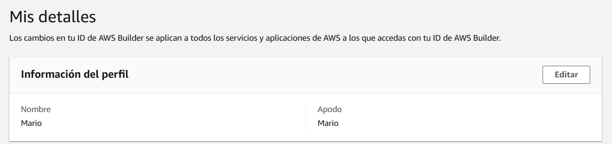
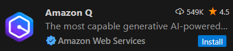
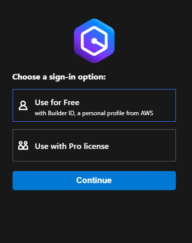
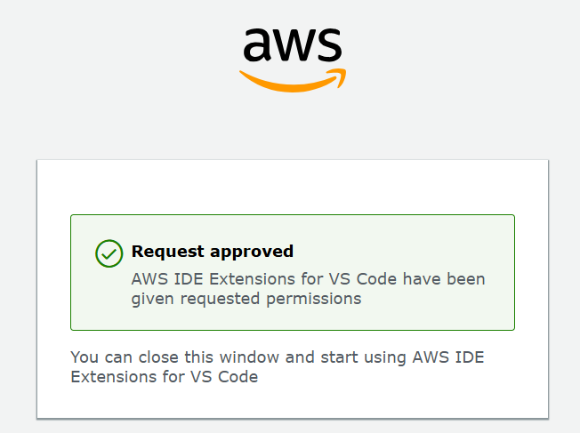
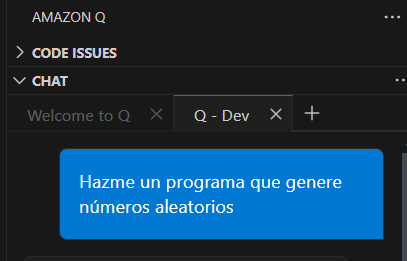
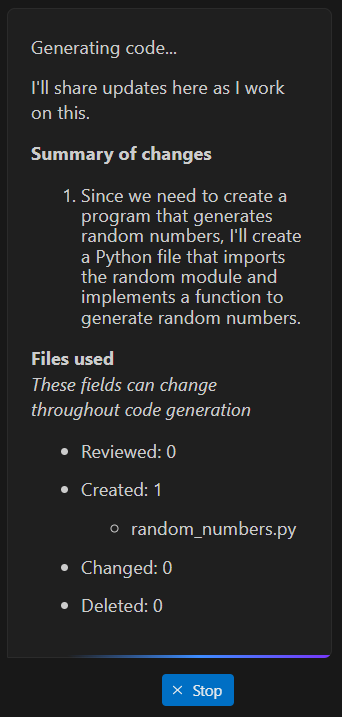

# Instalación y set-up de Amazon Q
## Creación de cuenta de ID-Builder
Lo primero que se ha hecho es crear una cuenta de ID-Builder de AWS

## Instalación del plugin de Amazon Q en VS Code

## Configuración del plugin

## Probando Amazon Q

Amazon Q generó el programa deseado y, al aceptar los cambios se incorporó al repositorio
